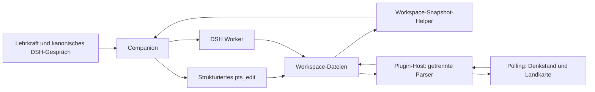

# Thinking Space und Teaching Product

Architektur-Audit und Umsetzungsstand, 2026-09-06/07. Der Zielentwurf ist in
den aktuellen DSH-nativen Plugins und Domain-Routen umgesetzt; die
automatisierte Abnahme ist unten dokumentiert.
Der Auftrag autorisiert die technische Migration, keine neuen pädagogischen
Entscheidungen in bestehenden Denkräumen. Bestehende Arbeitsräume bleiben bis
zu einer expliziten Migration unverändert.

## Audit: heutiger Zustand

| Kanonisches Artefakt | Inhalt / Leser / Schreiber | Befund |
| --- | --- | --- |
| `learning-design.md` | Freies Markdown: Kontext, Intention, Lernweg, Fragen, Materialien, Reflexion; Worker und Denkstand-Akzentaktionen schreiben; Denkstand und Snapshot lesen Teilmengen | Thinking Model, kein normalisiertes Stundenmodell. Zusammenfassungen können hinter Entscheidungen zurückbleiben. |
| `learning-landscape.md` | Lernmomente mit stabilen IDs, didaktischer Funktion, Lernaktivität, erwarteter Erfahrung, Materialbedarfen, Materialpfaden, Fragen, Reifegrad und Herkunft; bisher zusätzlich Übergänge und eine graphartige Darstellung; `pts-landscape` liest/schreibt, Worker schreiben | Die praktisch tragfähige Einheit ist der **Lernmoment**, nicht der Übergang. Die Übergangslogik hat sich in der Nutzung nicht als zentrale Arbeitsform bewährt. Künftig wird die Datei als kanonische **Lernmoment-Sammlung** verstanden. Lernmomente können einer didaktischen Funktion wie Einstieg, Erkunden, Erarbeiten, Vertiefen, Sichern oder Transfer zugeordnet werden. Diese Einordnung ist keine Unterrichtsphase und keine zeitliche Platzierung. Übergänge gehören nicht mehr zum primären Zielmodell. |
| `temporal-plan.yml` | `windows` mit IDs, Titel, Art, Dauer, Status; `placements` mit Moment-/Fenster-ID, Start, Dauer, Rolle, Modus, Status, Notiz | Bereits vorhandener Vorläufer der Produktstruktur. Die Landkarte schreibt komplette Zeitpläne einschließlich Drag-and-drop-Zuordnungen. |
| `learning-landscape.layout.json` | Kartenpositionen und Gruppenbänder | Ausschließlich Darstellung; weiterverwenden. |
| `decisions.yml` | Bestätigte Entscheidungen; heterogene Felder `statement`, `decision`, `title`, `evidence`, `rationale` | Ein kanonisches Entscheidungsregister erhalten. Snapshot liest bisher nur `statement`; direkte Bearbeitung schreibt `decision`: konkrete Synchronisationslücke. |
| `planning-board.yml` | Arbeitsvorhaben, Klärungen, vorgeschlagen/freigegeben | Arbeitsgedächtnis, weder Stundenplan noch Produktreife. |
| `materials/`, `rendered/`, `drafts/`, `knowledge-proposals/` | Dateien, teils Frontmatter mit `related_moments`; Moment hat zusätzlich `materials` | Materialinhalt nicht kopieren. Vorhandene Beziehungen sind nicht automatisch bestätigte Phasenverwendungen. |

Belegstellen: `dsh-plugins/pts-landscape/lib/index.js` (`parseLandscape`,
`parseTemporal`, `parseMaterialMeta`, Schreib-Routen), dessen `lib/client.js`
(`LandscapeView`, `MomentEditor`, `saveTemporal`, `chatMoment`),
`dsh-plugins/pts-denkstand/lib/index.js` (separater YAML-Parser und
Akzent-/Frageaktionen), `dsh-presets/pts-companion/direct-pts-edit.mjs`
(`add_open_question`, `record_decision`), `workspace-snapshot.mjs`
(`buildSnapshot`), `dsh-plugins/pts-workspaces/lib/index.js` (`scaffold`).

Stichprobe `workspace/hoffnung`: Zeitfenster `tw-01`, drei Platzierungen,
mehrere Lernmomente. Eine Platzierung verweist in ihrer Notiz auf mehrere
Phasen. Der Zeitfensterstatus ist `proposed`, während die Notiz eine Freigabe
behauptet. Aus diesem Widerspruch darf keine neue Freigabe abgeleitet werden.
Freie Verlaufspläne in Materialdateien sind keine maschinell bestätigte
Unterrichtsstruktur. Der Audit verifiziert keine darin genannten Fachquellen.

Aktueller Datenfluss:



Mit `workspace-snapshot.mjs` existiert eine verbindliche Context Projection für
eine fokusspezifische, revisionsbewusste und budgetierte Workspace-Projektion.
Der verbindliche **Prompt-Snapshot je Companion-Turn**
ist als gemeinsame Leseschnittstelle etabliert. Sichtbare Kürzungen und ein
Workspace-Überblick machen die Begrenzung nachvollziehbar; eine zweite
PTS-History entsteht dadurch nicht.

Plugin-Grenzen: `pts-workspaces` besitzt Workspace-Auswahl/Scaffold;
`pts-landscape` besitzt Karten, Momenteditor, Materialbeziehungen und
Artefaktzugriff; `pts-denkstand` besitzt Denkstand/Board/Entscheidungseinblick;
`artifact-panel` liefert Vorschau; `pts-web-brand` zeigt das kanonische Gespräch
als Overlay. Activity Stream und Workspace Git bleiben DSH-bezogene Projektionen.
Keine dieser Flächen soll einen eigenen Produktbestand halten.

Installierte DSH-Primitiven: `@deepseek-ai/dsh-client-ui-conversation`
`0.1.2-rc.1`, geprüft im globalen CLI-Paket unter
`C:/nvm4w/nodejs/node_modules/@deepseek-ai/dsh/node_modules/`:
`conversation.view`, `inputActions.setDraft`, `openView` und
`uiConversation.binding(...).target('chat')` sind vorhanden. Das bestehende
Preset registriert Tools und dynamische System-Prompt-Sektionen. Host-Routen
werden über `webServer.register` mit `ctx.effect` entsorgt. Diese Primitiven
reichen aus; kein neuer Dispatcher, Gesprächsspeicher oder Worker-Lebenszyklus.

## Zielzustand und Autorität

Das PTS ist die Denkwerkstatt; ihr Produkt ist die Unterrichtsreihe.
Thinking-Artefakte bleiben erhalten. Ein versioniertes `teaching-product.json`
ist nach Migration alleinige Wahrheit für `series -> lessons -> phases ->
materials`. Materialverwendungen enthalten Pfade, keine Materialkopien.
Phasen besitzen eigene IDs und optionale Mehrfachreferenzen auf Lernmomente.
Lernmomentänderungen überschreiben bestätigte Phasen niemals automatisch.


Die bisherige Lernlandschaft wird fachlich zur **Lernmoment-Werkstatt**
weiterentwickelt.

Ein Lernmoment beschreibt eine pädagogische Möglichkeit: eine Situation,
Tätigkeit, Erfahrung oder Denkbewegung, die für den Lernprozess interessant
sein könnte. Lernmomente bilden noch keine konkrete Unterrichtsstunde und
besitzen keine Phasenidentität.

Die primäre Projektion der Lernmoment-Sammlung ist ein ruhiges Board nach
**didaktischen Funktionen**. Eine sinnvolle Standardkonfiguration ist:

```text
Einstieg
Erkunden
Erarbeiten
Vertiefen
Sichern
Transfer
```

Diese Kategorien sind keine Fortschrittszustände wie `todo`, `in_progress`
oder `done`. Sie beschreiben die gegenwärtige didaktische Einordnung eines
Lernmoments. Das Funktionsschema bleibt konfigurierbar und darf nicht als
universelles Unterrichtsmodell fest in die Domäne codiert werden.

Das Verschieben eines Lernmoments zwischen diesen Bereichen verändert
ausschließlich seine didaktische Einordnung. Es erzeugt keine Unterrichtsphase,
keine zeitliche Platzierung und keine bestätigte Produktänderung.

Lernmoment und Unterrichtsphase bleiben unterschiedliche Entitäten:

```text
Lernmoment
„Eigene Vorstellungen von Hoffnung sichtbar machen“
        │
        ├── mögliche Verwendung
        ▼
Teaching Product

Stunde 1
└── Phase 1 · Einstieg · 10 Minuten

Stunde 4
└── Phase 4 · Rückblick/Sicherung · 8 Minuten
```

Ein Lernmoment kann daher in mehreren Stunden und Phasen verwendet werden.
Eine konkrete Verwendung entsteht ausschließlich im `teaching-product.json`,
gegebenenfalls zunächst als Produktvorschlag. Änderungen am Lernmoment
verändern bereits bestätigte Phasen niemals automatisch.

Materialbeziehungen eines Lernmoments bleiben erhalten. Eine
Materialbeziehung am Lernmoment bedeutet jedoch nicht automatisch, dass dieses
Material in jeder daraus entstandenen Phase verwendet wird. Die konkrete
Materialverwendung wird im Teaching Product festgelegt.

Die bisherige Übergangsstruktur der Lernlandschaft gehört nicht mehr zum
primären Zielmodell. Bestehende Übergangsdaten können bei der Migration
erhalten oder als Legacy-Information lesbar bleiben, dürfen aber keine
Voraussetzung für die neue Lernmoment-Werkstatt sein.

Im selben Produktartefakt liegen vorgeschlagene Produktänderungen mit
Quellrevision, Begründung und Referenzen. Ein Vorschlag verändert die Reihe
nicht. Übernahme benötigt eine bestätigte Entscheidung aus `decisions.yml`;
die UI kann diese durch die explizite Übernahmehandlung protokollieren.
Companion-Aufrufe dürfen keine Lehrkraftfreigabe aus Produktvollständigkeit
ableiten. Produktreife und Verwendbarkeit werden getrennt:
strukturelle Lücken, Companion-Einschätzung mit Begründung und ausdrückliche
Lehrkraftentscheidung. Kein Prozentwert, keine implizite Verwendbarkeit.

Kleine Änderungen an einer bereits bestehenden Stunde müssen nicht die
gesamte Reihe als JSON rekonstruieren. Dafür nutzt der Companion die begrenzte
Operation `propose_lesson_intention` mit Stunden-ID, Intention und Begründung;
danach folgen bei ausdrücklicher Zustimmung automatisch die dokumentierte
Entscheidung und `accept_product`. Eine Zustimmung wie „ja bitte“ zur direkt
zuvor vorgeschlagenen Formulierung ist dafür ausreichend und wird nicht durch
eine weitere technische Rückfrage unterbrochen.

Ein gemeinsames Domänen-/Persistenzmodul wird vom vorhandenen Host und
`pts_edit` verwendet. Versionierte Read/write-Operationen, begrenzte Eingaben,
Workspace-/Realpath-Prüfung, atomarer Dateiersatz und optimistische
Revisionsprüfung verhindern unabhängige Panel-Wahrheiten. Fehlerhafte Dateien
werden nicht als leerer Zustand überschrieben. Eine kurzlebige Dateisperre
schützt Schreibtransaktionen; sie ist kein Job-System. Entscheidungen werden
vor der referenzierenden Produktänderung geschrieben. Bei Teilausfall bleibt
die Entscheidung sichtbar; der Vorschlag ist wiederholbar über ihre ID.


Der Companion erhält bei jedem Turn einen neu berechneten
**Prompt Snapshot** als gemeinsame Context Projection. Dieser Snapshot ist
keine weitere kanonische Datei und wird nicht als eigener Denkstand
zurückgeschrieben. Er wird deterministisch aus den kanonischen
Workspace-Artefakten, dem Teaching Product, offenen Produktvorschlägen,
relevanten Entscheidungen, Arbeitsständen und dem aktuellen Focus Context
erzeugt.

Der Snapshot ist strukturiert und begrenzt. Er lädt nicht pauschal alle
Workspace-Inhalte, sondern priorisiert den aktuellen Gegenstand und unmittelbar
relevante Referenzen. Bei einem Phasenfokus gehören beispielsweise die Phase,
ihre Stunde, referenzierte Lernmomente, konkrete Materialverwendungen,
relevante Entscheidungen und offene Vorschläge in den Kontext; nicht
automatisch die vollständige Materialsammlung oder alle Lernmomente des
Workspace.

Jeder Snapshot enthält die für Konflikt- und Aktualitätsprüfung nötigen
Revisionen beziehungsweise Provenance. Fehlerhafte, widersprüchliche oder
veraltete Quelldaten werden nicht stillschweigend normalisiert. Der Snapshot
darf keine neue pädagogische Wahrheit erzeugen und keine Freigaben ableiten.

Damit gilt als Architekturgrenze:

```text
                 LESEN
Workspace ──→ Prompt Snapshot ──→ Companion
                                  │
                                  │ pts_edit
                                  ▼
Workspace ←──── Domain Store ←────┘
                 SCHREIBEN
```

Der Companion liest den kanonischen Workspace nicht über eigene, verteilte
Dateiparser zusammen und schreibt kanonische Zustände nicht direkt in Dateien.
Lesender Laufzeitkontext wird über die Context Projection bereitgestellt;
strukturierte Änderungen laufen über `pts_edit` und denselben Domain Store,
den auch die UI verwendet.

Product Status ist eine jederzeit neu berechnete, kompakte Projektion: vorhandene
Unterrichtsstunden, Ideen, Ausarbeitung, offene Voraussetzungen, Verwendbarkeit
und nächster Arbeitsschritt. Sie dient der Orientierung und enthält keine eigene
Produktbearbeitung. Die ausführliche Arbeitsansicht bleibt die
**Unterrichtsreihe**: Dort werden Stunden und Phasen gelesen und entwickelt,
Materialien geöffnet, Vorschläge verglichen und ausdrücklich übernommen sowie
Verwendbarkeit bestätigt. Unterrichtsreihe und Status werden als
zusätzliche Ansichten im vorhandenen `pts-landscape`-Paket eingebunden, ohne
einen neuen Plugin-Loader.
Offene Statuspunkte tragen stabile IDs. Eine ausdrückliche Lehrkraftaktion kann
einen Punkt als erledigt oder bewusst nicht erforderlich markieren; diese
Entscheidung wird im bestehenden Register `decisions.yml` festgehalten. Das
Chatsymbol öffnet den zugehörigen Gegenstand im kanonischen DSH-Gespräch.
Denkgeschichte bleibt nachgeordnet einsehbar. Der Dateibaum ist keine
Produktnavigation.

Focus Context ist temporärer, sessionbezogener Kontext im selben Workspace:
`kind` (moment/lesson/phase/material/question), `id`, `returnView`. Das
persistente Conversation Binding ist davon getrennt und ordnet ein Objekt über
`kind:id` einer DSH-Session zu.
Der Host löst Referenzen gegen aktuelle Artefakte auf. Der Prompt Snapshot
wertet diesen Fokus bei jedem Companion-Turn aus und stellt den aktuellen
Gegenstand zusammen mit den dafür relevanten kanonischen Artefakten bereit.
Die UI verwendet denselben DSH-Composer und dieselbe History der jeweils
geöffneten DSH-Session. Ein reiner Fokuswechsel erzeugt weder Session noch
Unterordner. Die bewusste Aktion „Darüber sprechen“ erzeugt beim ersten Mal
eine frische DSH-Session im selben Denkraum und öffnet danach genau diese
Session wieder. Fokus beenden entfernt nur den temporären Kontext.
Ungültige Referenzen melden einen Fehler.

## Migrationspfad und Arbeitspakete

1. **Domänenmodell:** Schema, stabile IDs, Validierung, Vorschlag versus
   bestätigtes Produkt, Referenzen und Bereitschaft. Tests: keine implizite
   Moment-zu-Phase-Zuordnung, ungültige Referenzen/IDs abweisen.
2. **Persistenz/API:** gemeinsamen Store an den bestehenden Host anbinden;
   explizite Migration mit Vorschau. IDs der Zeitfenster bleiben Lesson-IDs,
   Platzierungs-IDs werden Phase-IDs in einem prüfbaren Migrationsvorschlag.
   Ursprüngliche Zeitdatei bleibt unverändert als Legacy-Beleg; danach sperren
   die bisherigen Zeit-Schreibwege. Lesende Legacy-Projektionen stammen aus
   dem Produkt. Kein Dual-write. Mehrphasige Prosa nicht automatisch aufteilen.
   Migration wiederholen verändert vorhandenes Produkt nicht. Neue Workspaces
   starten direkt mit leerem Produkt. Tests: Altbestand, Wiederholung,
   Fehlerzustände, Konflikte, Pfadgrenzen.
3. **Prompt Snapshot / Context Projection:** **umgesetzt.** Der gemeinsame,
   reine Snapshot-Builder ist die verbindliche Lesegrenze für jeden
   Companion-Turn. Er erzeugt den Laufzeitkontext aus den kanonischen
   Workspace-Artefakten, `teaching-product.json`, offenen Produktvorschlägen,
   relevanten Entscheidungen, Arbeitsständen und dem aktuellen Focus Context.
   Der Snapshot ist keine kanonische Datei, wird nicht unabhängig
   zurückgeschrieben und darf keine Entscheidungen oder Freigaben ableiten.
   Er priorisiert fokussierte und unmittelbar referenzierte Inhalte statt den
   gesamten Workspace pauschal in den Prompt zu laden. Revisionen und
   Provenance bleiben sichtbar; fehlerhafte oder widersprüchliche Quelldaten
   werden nicht stillschweigend normalisiert. Tests: deterministische Projektion,
   Fokuswechsel, Produktänderungen, neue Entscheidungen, offene und veraltete
   Vorschläge, mehrfach referenzierte Lernmomente, ungültige Referenzen,
   Kontextbegrenzung und Aktualisierung zwischen zwei aufeinanderfolgenden
   Turns.
4. **Companion:** `pts_edit` um strukturierte Produktvorschläge und deren
   bestätigte Übernahme erweitern. Der Companion erhält seinen
   Workspace-Kontext über den gemeinsamen Prompt Snapshot und schreibt
   kanonische Zustände ausschließlich über strukturierte Domain-Operationen.
   Tests über echte Toolregistrierung und Dateien, ohne einen simulierten
   Modellbeweis.
5. **Status:** gemeinsame reine Projektion mit nachvollziehbaren Lücken und
   getrennten Einschätzungen. Tests vor/nach Übernahme und Quelländerung.
6. **Produktpanel:** lesbare Stunden/Phasen, Materialzugriff, Vorschlagsvergleich,
   explizite Übernahme, Verwendbarkeit und Weiterdenken. UI-Flow-Tests.
7. **Generischer Fokus:** sessionisolierte Host-Auflösung, Prompt-Einbindung,
   Fokus beenden und Rückweg; Tests für alle Gegenstandstypen und Isolation.
8. **Lernmoment-Werkstatt:** **umgesetzt.** Die bisherige Lernlandschaft ist
   fachlich und in der primären UI zur Lernmoment-Werkstatt weiterentwickelt;
   Produkt- und Statusansichten bleiben erhalten. `pts-moment-workshop` ist
   der einzige sichtbare `conversation.view`-Eintrag für Lernmomente;
   `pts-landscape` registriert dort keinen parallelen Legacy-Tab.

   - Lernmomente bleiben kanonische, eigenständige Denkobjekte.
   - Der bestehende Momenteditor bleibt erhalten und wird Teil der Lernmoment-Werkstatt.
   - Öffnen des Editors erzeugt keinen Thread. „Darüber sprechen“ setzt den
     temporären Focus Context und bindet den Gegenstand an eine frische oder
     wieder geöffnete DSH-Session im selben Denkraum. Es gibt keine PTS-History
     und keine Fork-/Kopie-Logik.
   - Die graphartige Übergangslogik ist nicht mehr Bestandteil der primären Arbeitsform.
   - Primäransicht wird ein ruhiges Board nach didaktischen Funktionen.
   - Standardfunktionen zunächst:
     `Einstieg`, `Erkunden`, `Erarbeiten`, `Vertiefen`, `Sichern`, `Transfer`.
   - Das Funktionsschema bleibt konfigurierbar und wird nicht als universelles Unterrichtsphasenmodell fest in die Domäne codiert.
   - Drag-and-drop verändert ausschließlich die didaktische Einordnung eines Lernmoments.
   - Verschieben erzeugt weder eine Unterrichtsphase noch eine zeitliche Platzierung.
   - Momenteditor, Ausarbeitung, Materialbeziehungen, Fragen, Herkunft und Reifegrad bleiben erhalten.
   - Ein Lernmoment kann aus der Werkstatt heraus besprochen, weiterentwickelt oder als Grundlage einer Produktänderung vorgeschlagen werden.
   - Die konkrete Verwendung eines Lernmoments im Teaching Product erfolgt ausschließlich über eine Produktreferenz beziehungsweise einen Produktvorschlag.
   - Ein Lernmoment darf in mehreren Stunden und Phasen verwendet werden.
   - Änderungen am Lernmoment überschreiben bestätigte Phasen niemals automatisch.
   - Zeitplanung, Stunden-Dropziele und Unterrichtsplatzierungen werden vollständig aus der Lernmoment-Werkstatt entfernt.
   - Materialbeziehungen am Lernmoment bleiben vorgelagerte Möglichkeiten; konkrete Materialverwendungen gehören zum Teaching Product.
   - Bestehende Übergangsdaten können als Legacy-Information erhalten bleiben, sind aber keine Voraussetzung für die neue Ansicht.

   - Beispiel-Conversation-Baum für die Konversation zu einem Lernmoment 
	
	Workspace „Hoffnung“
	│
	├── Allgemeines Gespräch
	│
	│   „Was wollen wir mit der Reihe erreichen?“
   │   „Was liegt in diesem Thread gerade auf dem Tisch?“
	│
	├── Lernmoment moment-07
	│   └── eigene DSH-Conversation-Session
	│       „Wie könnte dieser Moment funktionieren?“
	│       „Was machen die Lernenden konkret?“
	│       „Ich bin mit dem Einstieg noch nicht zufrieden …“
	│       └── beim nächsten Öffnen wiederaufnehmbarer DSH-Thread
	│
	├── Lernmoment moment-12
	│   └── eigene DSH-Conversation-Session
	│
	└── Teaching Product
		└── Phase phase-04
			└── ggf. eigene DSH-Conversation-Session


   Tests:
   - Öffnen/Besprechen setzt den korrekten Focus Context.
   - Fokuswechsel erzeugt keinen Sub-Workspace.
   - Verschieben eines Moments ändert nur seine didaktische Funktion.
   - Verschieben erzeugt keine Phase.
   - Ein Moment kann mehrfach im Teaching Product referenziert werden.
   - Änderung eines mehrfach verwendeten Moments verändert keine bestätigte Phase.
   - konfigurierbares Funktionsschema.
   - Materialbeziehung am Moment wird nicht automatisch zur Phasenverwendung.
   - Legacy-Workspaces mit Übergängen bleiben lesbar.
   - UI-Flow-Test für Board → Moment öffnen → darüber sprechen → Thread wieder
     öffnen mit aktuellem Workspace-Snapshot.


   
10. **Dokumentation/Abnahme:** Architektur, Bedienfluss und Betriebsgrenzen
   aktualisieren; automatisierte Integration und Browserabnahme getrennt
   ausweisen. Keine Änderung bestehender Unterrichtsinhalte für Tests.

Zentraler E2E: Vor jedem Companion-Turn wird der Prompt Snapshot aus dem
aktuellen Workspace und Focus Context neu erzeugt -> Lernmoment entsteht oder
wird im Gespräch weiterentwickelt -> Companion hält ihn in der
Lernmoment-Werkstatt fest -> der folgende Turn sieht den aktualisierten
Snapshot -> Lernmoment wird einer didaktischen Funktion wie `Erkunden`
zugeordnet -> Lernmoment wird dort weiterentwickelt und gegebenenfalls mit
Material verbunden -> daraus entsteht ein konkreter Vorschlag für die
Verwendung in einer Phase einer Stunde ->
Lehrkraft bestätigt -> Phase mit eigener ID entsteht im Teaching Product ->
Reihe und Status ändern sich -> ursprünglicher Lernmoment bleibt eigenständig
erhalten und kann später für eine weitere Phase vorgeschlagen werden -> Stunde
öffnen -> unfertige Phase weiterdenken -> gleicher Workspace, gegenstandsbezogener persistenter Conversation-Thread,
gemeinsamer kanonischer Denkstand. Der implementierte Browser-E2E prüft außerdem
Lernmoment -> „Darüber sprechen“ -> Thread wieder öffnen und den aktuellen
Workspace-Snapshot. Zusätzlich Ablehnung, veralteter Vorschlag, mehrfach
verwendeter Moment, fehlendes Material und Reload prüfen.
Ein deterministischer UI/HTTP/Tool-Test belegt die Verdrahtung; autonomes
Modellverhalten und laufende DSH-Browserdarstellung benötigen eigene Abnahme.

Rollback: Code zurücksetzen und vor produktiver Weiterarbeit den alten
Zeitstand bewusst wiederherstellen. Die Legacy-Datei ist nach Migration
historisch und darf nicht automatisch reaktiviert werden: neue Produktarbeit
wäre sonst unsichtbar. Produktdatei und Entscheidungsregister aufbewahren.
