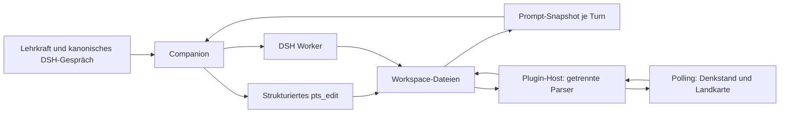

# Thinking Space und Teaching Product

Architektur-Audit und Zielentwurf, 2026-09-06. Vor der Implementierung erstellt.
Der Auftrag autorisiert die technische Migration, keine neuen pädagogischen
Entscheidungen in bestehenden Denkräumen. Bestehende Arbeitsräume bleiben bis
zu einer expliziten Migration unverändert.

## Audit: heutiger Zustand

| Kanonisches Artefakt | Inhalt / Leser / Schreiber | Befund |
| --- | --- | --- |
| `learning-design.md` | Freies Markdown: Kontext, Intention, Lernweg, Fragen, Materialien, Reflexion; Worker und Denkstand-Akzentaktionen schreiben; Denkstand und Snapshot lesen Teilmengen | Thinking Model, kein normalisiertes Stundenmodell. Zusammenfassungen können hinter Entscheidungen zurückbleiben. |
| `learning-landscape.md` | IDs in `###`-Blöcken, Funktion, Lernaktivität, erwartete Erfahrung, Materialbedarfe, Materialpfade, Fragen, draft/stable, Herkunft, Zeitbedarf; `pts-landscape` liest/schreibt, Worker schreiben | Lernmomente und pädagogische Übergänge; keine Phasenidentität. |
| `temporal-plan.yml` | `windows` mit IDs, Titel, Art, Dauer, Status; `placements` mit Moment-/Fenster-ID, Start, Dauer, Rolle, Modus, Status, Notiz | Bereits vorhandener Vorläufer der Produktstruktur. Die Landkarte schreibt komplette Zeitpläne einschließlich Drag-and-drop-Zuordnungen. |
| `learning-landscape.layout.json` | Kartenpositionen und Gruppenbänder | Ausschließlich Darstellung; weiterverwenden. |
| `decisions.yml` | Bestätigte Entscheidungen; heterogene Felder `statement`, `decision`, `title`, `evidence`, `rationale` | Ein kanonisches Entscheidungsregister erhalten. Snapshot liest bisher nur `statement`; direkte Bearbeitung schreibt `decision`: konkrete Synchronisationslücke. |
| `planning-board.yml` | Arbeitsvorhaben, Klärungen, vorgeschlagen/freigegeben | Arbeitsgedächtnis, weder Stundenplan noch Produktreife. |
| `materials/`, `rendered/`, `drafts/`, `knowledge-proposals/` | Dateien, teils Frontmatter mit `related_moments`; Moment hat zusätzlich `materials` | Materialinhalt nicht kopieren. Vorhandene Beziehungen sind nicht automatisch bestätigte Phasenverwendungen. |

Belegstellen: `dsh-plugins/pts-landscape/lib/index.js` (`parseLandscape`,
`parseTemporal`, `parseMaterialMeta`, Schreib-Routen), dessen `lib/client.js`
(`LandscapeView`, `MomentEditor`, `saveTemporal`, `chatMoment`),
`dsh-plugins/pts-denkstand/lib/index.js` (separater YAML-Parser und
Akzent-/Frageaktionen), `dsh-presets/pts-companion/direct-pts-edit.mjs`
(`add_open_question`, `record_decision`), `workspace-snapshot.mjs`
(`buildSnapshot`), `dsh-plugins/pts-workspaces/lib/index.js` (`scaffold`).

Stichprobe `workspace/hoffnung`: Zeitfenster `tw-01`, drei Platzierungen,
mehrere Lernmomente. Eine Platzierung verweist in ihrer Notiz auf mehrere
Phasen. Der Zeitfensterstatus ist `proposed`, während die Notiz eine Freigabe
behauptet. Aus diesem Widerspruch darf keine neue Freigabe abgeleitet werden.
Freie Verlaufspläne in Materialdateien sind keine maschinell bestätigte
Unterrichtsstruktur. Der Audit verifiziert keine darin genannten Fachquellen.

Aktueller Datenfluss:

Plugin-Grenzen: `pts-workspaces` besitzt Workspace-Auswahl/Scaffold;
`pts-landscape` besitzt Karten, Momenteditor, Materialbeziehungen und
Artefaktzugriff; `pts-denkstand` besitzt Denkstand/Board/Entscheidungseinblick;
`artifact-panel` liefert Vorschau; `pts-web-brand` zeigt das kanonische Gespräch
als Overlay. Activity Stream und Workspace Git bleiben DSH-bezogene Projektionen.
Keine dieser Flächen soll einen eigenen Produktbestand halten.

Installierte DSH-Primitiven: `@deepseek-ai/dsh-client-ui-conversation`
`0.1.2-rc.1`, geprüft im globalen CLI-Paket unter
`C:/nvm4w/nodejs/node_modules/@deepseek-ai/dsh/node_modules/`:
`conversation.view`, `inputActions.setDraft`, `openView` und
`uiConversation.binding(...).target('chat')` sind vorhanden. Das bestehende
Preset registriert Tools und dynamische System-Prompt-Sektionen. Host-Routen
werden über `webServer.register` mit `ctx.effect` entsorgt. Diese Primitiven
reichen aus; kein neuer Dispatcher, Gesprächsspeicher oder Worker-Lebenszyklus.

## Zielzustand und Autorität

Das PTS ist die Denkwerkstatt; ihr Produkt ist die Unterrichtsreihe.
Thinking-Artefakte bleiben erhalten. Ein versioniertes `teaching-product.json`
ist nach Migration alleinige Wahrheit für `series -> lessons -> phases ->
materials`. Materialverwendungen enthalten Pfade, keine Materialkopien.
Phasen besitzen eigene IDs und optionale Mehrfachreferenzen auf Lernmomente.
Lernmomentänderungen überschreiben bestätigte Phasen niemals automatisch.

Im selben Produktartefakt liegen vorgeschlagene Produktänderungen mit
Quellrevision, Begründung und Referenzen. Ein Vorschlag verändert die Reihe
nicht. Übernahme benötigt eine bestätigte Entscheidung aus `decisions.yml`;
die UI kann diese durch die explizite Übernahmehandlung protokollieren.
Companion-Aufrufe dürfen keine Lehrkraftfreigabe aus Produktvollständigkeit
ableiten. Produktreife und Unterrichtsbereitschaft werden getrennt:
strukturelle Lücken, Companion-Einschätzung mit Begründung und ausdrückliche
Lehrkraftentscheidung. Kein Prozentwert, keine implizite Bereitschaft.

Ein gemeinsames Domänen-/Persistenzmodul wird vom vorhandenen Host und
`pts_edit` verwendet. Versionierte Read/write-Operationen, begrenzte Eingaben,
Workspace-/Realpath-Prüfung, atomarer Dateiersatz und optimistische
Revisionsprüfung verhindern unabhängige Panel-Wahrheiten. Fehlerhafte Dateien
werden nicht als leerer Zustand überschrieben. Eine kurzlebige Dateisperre
schützt Schreibtransaktionen; sie ist kein Job-System. Entscheidungen werden
vor der referenzierenden Produktänderung geschrieben. Bei Teilausfall bleibt
die Entscheidung sichtbar; der Vorschlag ist wiederholbar über ihre ID.

Product Status ist eine jederzeit neu berechnete Projektion: vorhandene
Einheiten, Ideen, Ausarbeitung, offene Voraussetzungen und nächster
Arbeitsschritt. Unterrichtsreihe und Status werden als zusätzliche Ansichten
im vorhandenen `pts-landscape`-Paket eingebunden, ohne einen neuen Plugin-Loader.
Denkgeschichte bleibt nachgeordnet einsehbar. Der Dateibaum ist keine
Produktnavigation.

Focus Context ist temporärer, sessionbezogener Kontext im selben Workspace:
`kind` (moment/lesson/phase/material/question), `id`, `returnView`.
Der Host löst Referenzen gegen aktuelle Artefakte auf. Der bestehende
Prompt-Snapshot liest den Fokus; die UI verwendet denselben DSH-Composer und
dieselbe History. Ein Fokuswechsel erzeugt weder Session noch Unterordner.
Fokus beenden entfernt den Kontext. Ungültige Referenzen melden einen Fehler.

## Migrationspfad und Arbeitspakete

1. **Domänenmodell:** Schema, stabile IDs, Validierung, Vorschlag versus
   bestätigtes Produkt, Referenzen und Bereitschaft. Tests: keine implizite
   Moment-zu-Phase-Zuordnung, ungültige Referenzen/IDs abweisen.
2. **Persistenz/API:** gemeinsamen Store an den bestehenden Host anbinden;
   explizite Migration mit Vorschau. IDs der Zeitfenster bleiben Lesson-IDs,
   Platzierungs-IDs werden Phase-IDs in einem prüfbaren Migrationsvorschlag.
   Ursprüngliche Zeitdatei bleibt unverändert als Legacy-Beleg; danach sperren
   die bisherigen Zeit-Schreibwege. Lesende Legacy-Projektionen stammen aus
   dem Produkt. Kein Dual-write. Mehrphasige Prosa nicht automatisch aufteilen.
   Migration wiederholen verändert vorhandenes Produkt nicht. Neue Workspaces
   starten direkt mit leerem Produkt. Tests: Altbestand, Wiederholung,
   Fehlerzustände, Konflikte, Pfadgrenzen.
3. **Companion:** `pts_edit` um strukturierte Produktvorschläge und deren
   bestätigte Übernahme erweitern; Snapshot zeigt Produkt und offene Vorschläge,
   veraltete Momentbezüge, Entscheidungen und Fokus. Tests über echte
   Toolregistrierung und Dateien, ohne einen simulierten Modellbeweis.
4. **Status:** gemeinsame reine Projektion mit nachvollziehbaren Lücken und
   getrennten Einschätzungen. Tests vor/nach Übernahme und Quelländerung.
5. **Produktpanel:** lesbare Stunden/Phasen, Materialzugriff, Vorschlagsvergleich,
   explizite Übernahme, Unterrichtsbereitschaft und Weiterdenken. UI-Flow-Tests.
6. **Generischer Fokus:** sessionisolierte Host-Auflösung, Prompt-Einbindung,
   Fokus beenden und Rückweg; Tests für alle Gegenstandstypen und Isolation.
7. **Moment-Werkstatt:** bestehender Editor bleibt; Öffnen/Besprechen setzt
   denselben Focus Context. Kein Sub-Workspace. UI-Flow-Test.
8. **Landkarte reduzieren:** Zeitplaneditor und Stunden-Dropziele aus der
   primären Kartenansicht entfernen, Karten/Übergänge/Materialbeziehungen
   erhalten. Verwendungen kommen aus Produktprojektion. Regressionstest.
9. **Dokumentation/Abnahme:** Architektur, Bedienfluss und Betriebsgrenzen
   aktualisieren; automatisierte Integration und Browserabnahme getrennt
   ausweisen. Keine Änderung bestehender Unterrichtsinhalte für Tests.

Zentraler E2E: Lernmoment im Gespräch weiterentwickeln -> konkreter Vorschlag
für eine Phase einer Stunde -> Lehrkraft bestätigt -> Reihe und Status ändern
sich -> Stunde öffnen -> unfertige Phase weiterdenken -> gleicher Workspace,
gleicher Chat, aktueller Phasenkontext. Zusätzlich Ablehnung, veralteter
Vorschlag, mehrfach verwendeter Moment, fehlendes Material und Reload prüfen.
Ein deterministischer UI/HTTP/Tool-Test belegt die Verdrahtung; autonomes
Modellverhalten und laufende DSH-Browserdarstellung benötigen eigene Abnahme.

Rollback: Code zurücksetzen und vor produktiver Weiterarbeit den alten
Zeitstand bewusst wiederherstellen. Die Legacy-Datei ist nach Migration
historisch und darf nicht automatisch reaktiviert werden: neue Produktarbeit
wäre sonst unsichtbar. Produktdatei und Entscheidungsregister aufbewahren.
